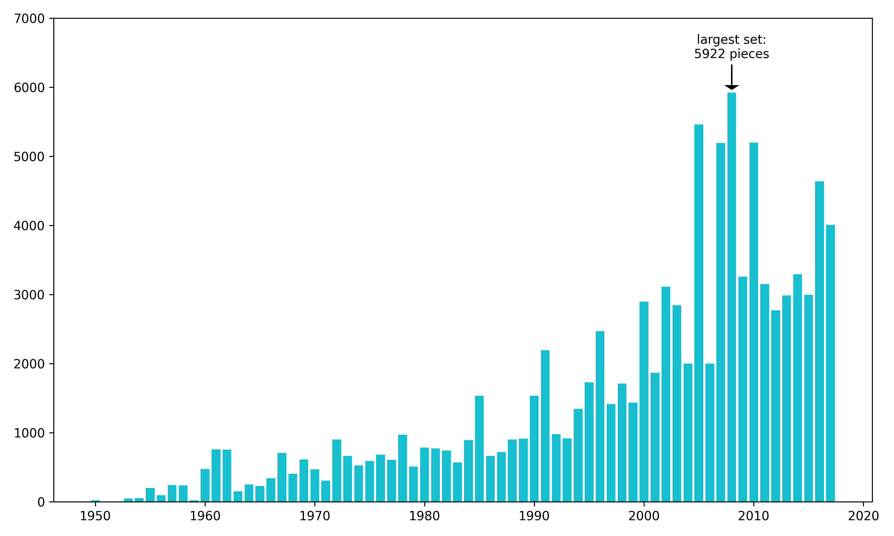
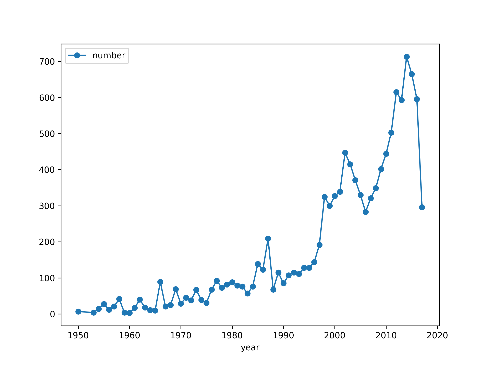
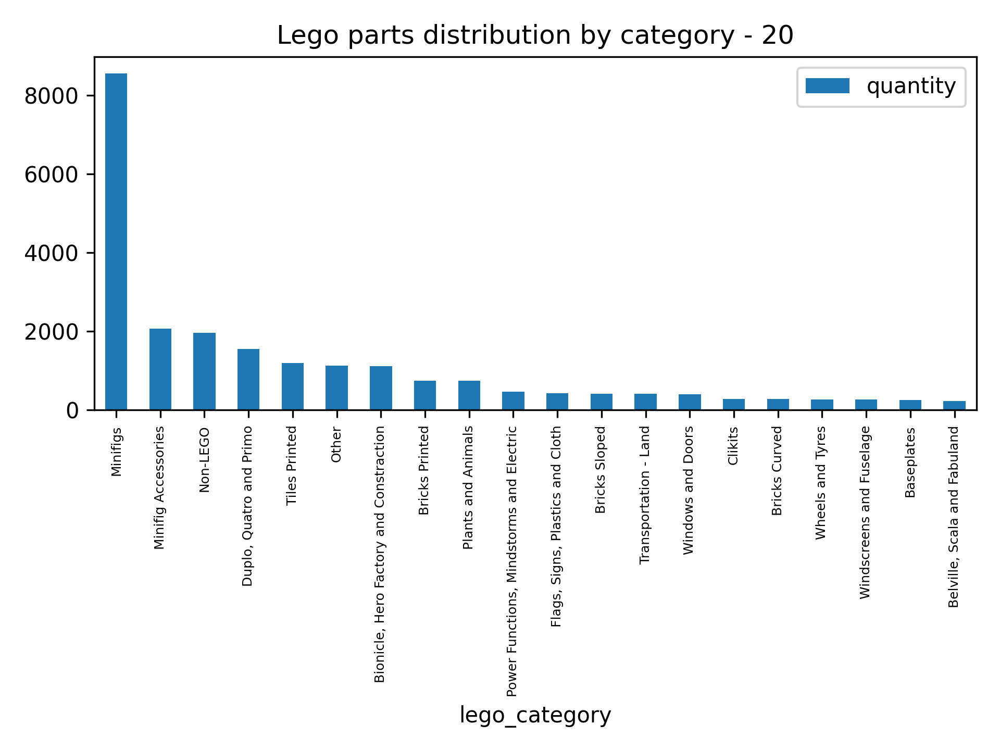
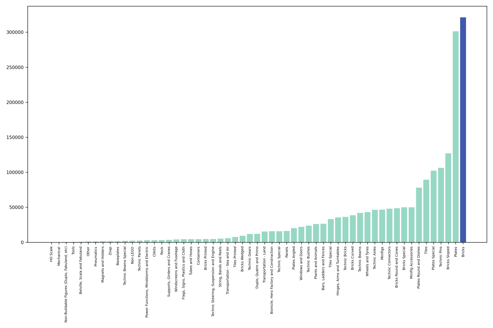
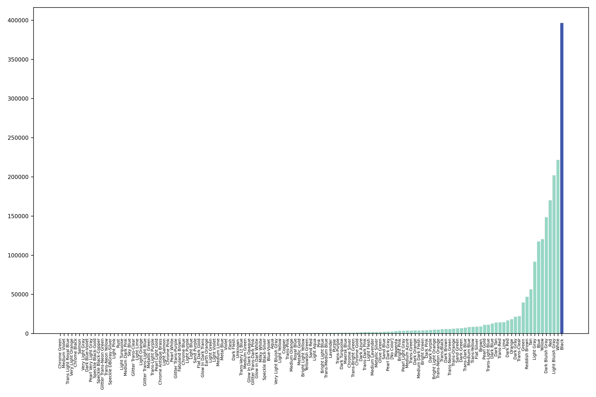

# PostgreSQL LEGO Dataset Analysis

## 1. Introduction
The goal of this project was to practice advanced PostgreSQL features (functions, DO blocks, automated exports)
using the LEGO dataset from Kaggle.

## 2. Database Setup
The LEGO dataset has been compiled into a SQL database and it can be found [here](https://github.com/neondatabase-labs/postgres-sample-dbs?tab=readme-ov-file#lego-database).However, the relationship among tables is missing. Therefore, the first step is to review the tables and add foreign keys to them. To this end, three SQL scripts were written: 
- [Add foreign keys to tables](./sql/lego_add_foreign_key.sql)
- [Drop all foreign keys](./sql/lego_drop_foreign_key.sql)
- [Drop a foreign keys in a specific table](./sql/lego_drop_specific_foreign_key_function.sql)

After establishing the relationships among tables, the resulted schema diagram:


## 3. Basic SQL queries
- **Query 1:** Find out the number of children sets of each parent set ([script file](./sql/the_number_of_children_sets.sql))
```sql 
/* use self-join to find out the number of children sets of each parent set */
select a.parent_id, b.name, count(a.name)
from lego_themes a join lego_themes b on a.parent_id=b.id
where a.parent_id in (select id
					  from lego_themes
					where parent_id is null)
group by a.parent_id, b.name
order by count(a.name) desc;
```

**Result (sample):**

| parent_id | name                    | count|
|-----------|-------------------------|------|
| 324       | Bionicle                | 38   |
| 535       | Collectible Minifigures | 24   |
| 507       | Educational and Dacta   | 20   |
| 126       | Space                   | 20   |
| 158       | Star Wars               | 19   |

Ful result: [The_number_of_children_sets.csv](./output/exports/The_number_of_children_sets.csv)


- **Query 2:** There are multple inventory_id for one set, which makes the stored quantity for each set imprecise. Here are three ways to correct it without losing information on inventory_id ([script file](./sql/Aggregation_without_losing_details.sql))

```sql
-- Aggregate but keep inventory_id as an array
select a.set_num, b.name, b.year, b.theme_id, b.num_parts, count(c.inventory_id) as total_quantity, a.version, 
	array_agg(c.inventory_id order by c.inventory_id) as inventory_ids -- use array_agg to collect all inventory_id 
from lego_inventories a
join lego_sets b on a.set_num = b.set_num
join lego_inventory_sets c on b.set_num = c.set_num
group by a.set_num, b.name, b.year, b.theme_id, b.num_parts, a.version
;
```
Full result: [Aggregation_with_array.csv](./output/exports/Aggregation_with_array.csv)

```sql
-- Use window function to count the number of each set; no aggregation 
select a.set_num, b.name, b.year, b.theme_id, b.num_parts, c.inventory_id, a.version, 
	count(*) over(partition by a.set_num)as total_quantity -- use window function
from lego_inventories a
join lego_sets b on a.set_num = b.set_num
join lego_inventory_sets c on b.set_num = c.set_num
order by a.set_num, c.inventory_id
;
```
Full result: [Aggregation_with_window_function.csv](./output/exports/Aggregation_with_window_function.csv)

```sql
 -- Two-step approach; make a summary table for counts and join it back
with count_sets as (
	select set_num, count(*) as total_quantity
		from lego_inventory_sets
	group by set_num)


select a.set_num, b.name, b.year, b.theme_id, b.num_parts, c.inventory_id, d.total_quantity, a.version
from lego_inventories a
join lego_sets b on a.set_num = b.set_num
join lego_inventory_sets c on b.set_num = c.set_num
join count_sets d on c.set_num = d.set_num
order by a.set_num, c.inventory_id
;
````
Full result: [Aggregation_two_steps.csv](./output/exports/Aggregation_two_steps.csv)


## 4. Anonymous Blocks
- **Block 1:** find out the name of children sets for each parent set ([script file](./sql/create_csv_for_the_theme_and_set.sql))

    Exported file: [The_name_of_children_sets.csv](./output/exports/The_name_of_children_sets.csv)

- **Block 2:** find out sets that have the same name and associated information like released year and number of parts in the sets ([script file](./sql/create_csv_sets_with_the_same_name.sql))

    Exported file: [Sets_with_the_same_name.csv](./output/exports/Sets_with_same_name.csv)

- **Block 3:** plot the the number of parts of the largest set in each year ([script file](./sql/plot_the_largest_set_each_year.sql))

    Plot: 

## 5. SQL Functions
- **Function 1:** plot the number of sets released in each year ([script file](./sql/plot_number_of_set_released_by_year.sql))
```sql
select plot_number_of_set_released_by_year();
````
Plot: 

- **Function 2:** plot the number of top 20 largest lego part categories ([script file](./sql/plot_lego_part_category_distribution.sql))
```sql
select plot_lego_part_category_distribution(20);
````
Plot: 

- **Function 3:**  plot the number of lego parts in inventory grouped by either color or category ([script file](./sql/plot_inventory_parts.sql))
```sql
select plot_inventory_parts('category');
select plot_inventory_parts('color');
````
Plot: 

Grouped by category:


Grouped by color:

